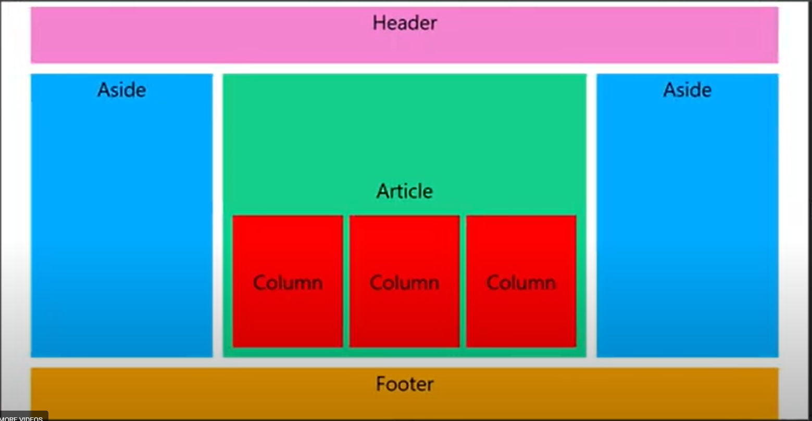
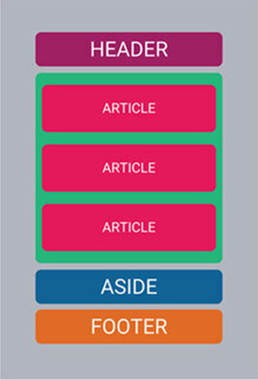

# Responsive CSS Grid Wireframe

A responsive, mobile-first HTML and CSS project demonstrating how **CSS Grid**, **semantic HTML**, and **media queries** can be used to create layouts that adapt across mobile, tablet, and desktop screen sizes.

This project began as a CSS Grid wireframe exercise and was expanded into a polished frontend project with responsive layouts, nested grids, improved accessibility, project documentation, and GitHub Pages deployment.

## Live Demo

View the deployed project on GitHub Pages:

[View Live Demo](https://tabner0320.github.io/grid-wireframe-practice/)

---

## Features

- Mobile-first responsive design
- CSS Grid page layout
- Nested CSS Grid content layout
- Mobile, tablet, and desktop breakpoints
- Semantic HTML structure
- Responsive sidebars and content areas
- Accessible headings and descriptive content
- Clean spacing, typography, and borders
- GitHub Pages deployment

---

## Technologies Used

| Technology | Purpose |
| --- | --- |
| HTML5 | Page structure and semantic markup |
| CSS3 | Styling and responsive design |
| CSS Grid | Main page and nested content layouts |
| Media Queries | Responsive breakpoints |
| Git | Version control |
| GitHub | Repository management |
| GitHub Pages | Live website deployment |
| Visual Studio Code | Development environment |

---

## Responsive Design

The project uses a **mobile-first approach**.

The default layout is optimized for smaller screens. Media queries progressively enhance the layout as additional screen space becomes available.

### Mobile

On smaller screens, the layout stacks vertically to improve readability and usability.

```text
Header
  ↓
Left Sidebar
  ↓
Main Content
  ↓
Right Sidebar
  ↓
Footer
```

### Tablet

At tablet widths, the layout begins using additional horizontal space while maintaining readable content areas.

### Desktop

On larger screens, the page expands into a multi-column layout:

```text
┌───────────────────────────────────────┐
│                Header                 │
├──────────┬─────────────────┬──────────┤
│   Left   │                 │  Right   │
│ Sidebar  │  Main Content   │ Sidebar  │
│          │                 │          │
│          │ ┌────┬────┬───┐ │          │
│          │ │ 1  │ 2  │ 3 │ │          │
│          │ └────┴────┴───┘ │          │
├──────────┴─────────────────┴──────────┤
│                Footer                 │
└───────────────────────────────────────┘
```

---

## CSS Grid Concepts Demonstrated

This project demonstrates several important CSS Grid concepts:

- `display: grid`
- `grid-template-columns`
- `gap`
- Responsive grid layouts
- Nested CSS Grid
- Flexible column sizing
- Mobile-first breakpoints
- Layout changes with media queries

The main page grid controls the overall page structure, while a second grid inside the main content area controls the three content cards.

---

## Semantic HTML

The page uses semantic HTML elements to make the document easier to understand and maintain.

Examples include:

```html
<header>
<main>
<aside>
<section>
<footer>
```

Using semantic elements also improves document structure and accessibility compared with relying entirely on generic `<div>` elements.

---

## Project Structure

```text
grid-wireframe-practice/
│
├── css/
│   └── style.css
│
├── index.html
├── README.md
├── desktop-wireframe.png
└── mobile-wireframe.png
```

### `index.html`

Contains the semantic HTML structure and content for the responsive layout.

### `css/style.css`

Contains the CSS Grid configuration, typography, spacing, borders, and responsive media queries.

### Wireframe Images

The desktop and mobile screenshots document how the layout behaves at different screen sizes.

---

## Screenshots

### Desktop Layout

The desktop version uses a three-column page layout with left and right sidebars surrounding the main content area.



### Mobile Layout

The mobile version stacks the content vertically for smaller screens.



---

## Run Locally

Clone the repository:

```bash
git clone https://github.com/tabner0320/grid-wireframe-practice.git
```

Move into the project directory:

```bash
cd grid-wireframe-practice
```

Open `index.html` in your browser.

You can also use the **Live Server** extension in Visual Studio Code for local development.

---

## Development Workflow

This project was improved using a feature-branch and pull-request workflow.

Changes were developed on a separate branch, reviewed through a GitHub pull request, and then merged into `main`.

The project is deployed from the `main` branch using GitHub Pages.

This workflow demonstrates practical experience with:

- Git branches
- Commits
- GitHub repositories
- Pull requests
- Code review workflow
- GitHub Pages deployment

---

## Skills Demonstrated

`HTML5` · `CSS3` · `CSS Grid` · `Responsive Web Design` · `Mobile-First Design` · `Media Queries` · `Semantic HTML` · `Accessibility` · `Git` · `GitHub` · `GitHub Pages`

---

## What I Learned

This project strengthened my understanding of:

- Building layouts with CSS Grid
- Creating nested grid structures
- Designing mobile-first interfaces
- Using media queries to adapt layouts
- Structuring pages with semantic HTML
- Testing layouts across different screen sizes
- Managing changes with Git branches and pull requests
- Deploying static websites with GitHub Pages

---

## Future Improvements

Possible future enhancements include:

- Additional responsive breakpoints
- More advanced CSS Grid layouts
- Improved accessibility testing
- Additional interactive components
- Dark mode support
- Automated HTML and CSS validation

---

## Author

**Theophilus M. Abner Jr.**

Software Developer | IT Professional | U.S. Army Veteran

[GitHub Profile](https://github.com/tabner0320)  
[Software Development Portfolio](https://tabner0320.github.io/theo-abner-resume/)